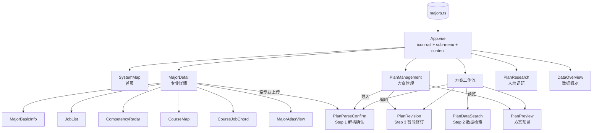

# 专业群建设系统生成 SOP

> Standard Operating Procedure — 基于 Claude Code Skill 一键生成专业群建设前端系统

---

## 一、流程概览


**总耗时**：约 30-40 分钟（含人工确认环节）

---

## 二、前置条件

| 项目 | 要求 |
|------|------|
| 运行环境 | macOS / Linux，Node.js ≥ 18 |
| 工具 | Claude Code CLI（已安装 `major-group-system` Skill） |
| 参考项目 | `/Users/Ronoy/major-group-system`（模板工程） |
| 输入材料 | 学校基本信息 + 人才培养方案（PDF/Word/口述均可） |

---

## 三、详细步骤

### Step 1：信息收集

#### 1.1 必填信息

向用户收集以下基本字段：

| 字段 | 说明 | 示例 |
|------|------|------|
| 学校名称 | 全称 | 深圳职业技术大学 |
| 学院名称 | 所属二级学院 | 人工智能学院 |
| 主专业名称 | 本次生成的核心专业 | 软件技术 |
| 专业代码 | 教育部专业代码 | 610205 |
| 培养层次 | 高职(专科) / 本科 等 | 高职(专科) |
| 学制 | 年限 | 3年 |
| 专业大类 | 教育部大类 | 电子与信息大类 |
| 所在地 | 城市 | 广东深圳 |

#### 1.2 人才培养方案数据提取

如果用户提供了培养方案文档，需从中提取：

| 数据类型 | 提取内容 | 注意事项 |
|----------|----------|----------|
| **课程列表** | 名称、类别、学分、学时、学期、描述 | 按 4 类分：专业基础课、专业核心课、AI实训课、专业拓展课 |
| **前序关系** | 课程之间的先修依赖 | 遵循学期递进逻辑，第1学期课程无前序 |
| **岗位匹配** | 岗位名称、分类、匹配率、薪资范围、技能要求 | 6-10 个典型就业岗位 |
| **能力图谱** | 能力维度名称 + 熟练度值(0-100) | 6-10 个维度，用于雷达图 |
| **课-岗关联** | 每门课覆盖哪些岗位技能、覆盖度百分比 | 按课程ID索引 |

#### 1.3 选填信息

| 字段 | 说明 |
|------|------|
| 专业群其他专业 | 同学院下的关联专业（名称+代码） |
| 专业标签 | 如：省级特色专业、产教融合、1+X试点 |
| 培养方案URL | 在线文档链接 |
| AI洞察文本 | 专业优势/机会描述 |

---

### Step 2：工程搭建

#### 2.1 创建项目目录

```bash
mkdir <project-name>
cd <project-name>
```

命名规范：`<学校简称>-<专业简称>-major-system`，如 `sz-software-major-system`。

#### 2.2 初始化工程配置

创建以下配置文件（直接从参考项目复制）：

| 文件 | 来源 | 说明 |
|------|------|------|
| `package.json` | 参考项目 | 依赖清单 |
| `vite.config.ts` | 参考项目 | Vite 配置 |
| `tsconfig.json` | 参考项目 | TypeScript 根配置 |
| `tsconfig.app.json` | 参考项目 | 应用 TS 配置 |
| `tsconfig.node.json` | 参考项目 | Node TS 配置 |
| `index.html` | 参考项目 | 入口 HTML |

#### 2.3 复制通用代码（不做修改）

以下文件与具体学校/专业无关，直接从参考项目 `/Users/Ronoy/major-group-system` 原样复制：

```
src/
├── main.ts                          # 入口，挂载 Element Plus + 样式
├── App.vue                          # 多页布局（icon-rail + sub-menu + content）
├── components/
│   ├── SystemMap.vue                # 首页：AI问答 + 工具网格 + 模块卡片
│   ├── MajorDetail.vue              # 专业详情：协调器（含空专业上传入口）
│   ├── MajorBasicInfo.vue           # 专业描述 + 统计入口卡片
│   ├── SectionTitle.vue             # 通用区块标题
│   ├── SearchHero.vue               # 搜索英雄区组件
│   ├── AiInsights.vue               # AI洞察组件
│   ├── JobList.vue                  # 岗位匹配列表 + 筛选 + 岗位选取 + AI推荐
│   ├── JobProfileDialog.vue         # 岗位详情弹窗
│   ├── JobAtlasDialog.vue           # 岗位图谱弹窗
│   ├── CompetencyRadar.vue          # ECharts Sankey/雷达图
│   ├── CourseMap.vue                # 课程地图 + SVG前序连线
│   ├── CourseDetailDialog.vue       # 课程详情 + 编辑模式
│   ├── CourseJobChord.vue           # 课-岗和弦图
│   ├── MajorAtlasView.vue          # 全屏力导向图
│   ├── DataOverview.vue             # 数据概览（政策/标准/方案统计）
│   ├── PlanManagement.vue           # 人培方案管理（CRUD列表）
│   ├── PlanParseConfirm.vue         # 方案工作流 Step 1：解析确认
│   ├── PlanDataSearch.vue           # 方案工作流 Step 2：数据检索
│   ├── PlanRevision.vue             # 方案工作流 Step 3：智能修订
│   ├── PlanPreview.vue              # 方案预览（目录 + 文档渲染 + 导出）
│   ├── PlanResearch.vue             # 人培调研落地页
│   ├── TeamManagement.vue           # 团队管理弹窗
│   └── PlaceholderPage.vue          # 占位页面
├── styles/
│   ├── global.scss                  # 全局样式
│   ├── design-token/                # iflyv 设计令牌（禁止修改）
│   │   ├── index.scss
│   │   ├── css/
│   │   │   ├── root.scss            # 浅色主题变量
│   │   │   ├── root-dark.scss       # 深色主题变量
│   │   │   ├── font.scss            # 字体系统
│   │   │   ├── brands.scss          # 品牌色
│   │   │   └── animation.scss       # 动画
│   │   └── font/                    # 字体文件
│   └── el-theme/                    # Element Plus 主题定制
│       ├── index.scss
│       ├── var-mapping.scss
│       ├── assets/
│       └── components/
```

> **关键原则**：组件层完全数据驱动，所有差异化内容通过 `src/data/majors.ts` 注入，组件代码无需任何修改。
> **App.vue 除外**：App.vue 包含学校特定的导航数据（orgData、statsMajorList），需在 Step 3b 中定制。

#### 2.4 安装依赖

```bash
npm install
npm install vue@^3.5 element-plus echarts vue-echarts lucide-vue-next sass --save
npm install vite @vitejs/plugin-vue vue-tsc typescript vite-plugin-singlefile --save-dev
```

---

### Step 3：数据层定制（核心步骤）

这是唯一需要根据学校/专业定制的文件：`src/data/majors.ts`。

#### 3.1 数据结构总览

```typescript
// ========== 接口定义 ==========
export interface MajorInfo { id, code, name, level, duration, college, group, location, description, enrollment, established, tags, trainingPlanUrl? }
export interface JobMatch { id, name, category, matchRate, salaryRange, demand, skills, profile: JobProfile }
export interface JobProfile { education, experience, level, demandCount, careerPath, tasks[], tools[], skills[], qualities[] }
export interface Course { id, name, category, credits, hours, semester, description, prerequisites?, objectives?, contents?, teachingMethods?, assessment? }
export interface CourseJobLink { jobId, jobName, coverage, coveredSkills[] }
export interface LearningTask { id, name, knowledge[], qualities[], generalSkills[], professionalSkills[] }
export interface CompetencyItem { name, value }
export interface CompetencyCategory { name, children: CompetencyItem[] }
export interface AiRecommendedJob { id, name, category, matchRate, salaryRange, reason, relatedCourses[], suggestedCourses? }
export interface College { id, name, majors: { id, name }[] }
```

#### 3.2 必须导出的数据映射

| 导出名 | 类型 | 索引键 | 数量建议 |
|--------|------|--------|----------|
| `colleges` | `College[]` | — | 1个学院，3-5个专业 |
| `majorInfoMap` | `Record<string, MajorInfo>` | majorId | 主专业必填 |
| `jobMatchMap` | `Record<string, JobMatch[]>` | majorId | 6-10个岗位/专业 |
| `courseMap` | `Record<string, Course[]>` | majorId | 15-25门课程，跨6个学期 |
| `competencyMap` | `Record<string, CompetencyItem[]>` | majorId | 6-10个能力维度 |
| `competencyCategoryMap` | `Record<string, CompetencyCategory[]>` | majorId | 3-5个分类 |
| `courseJobLinkMap` | `Record<string, CourseJobLink[]>` | courseId | 核心课程必填 |
| `learningTaskMap` | `Record<string, LearningTask[]>` | courseId | 每门课2-3个任务 |
| `jobCatalog` | `JobMatch[]` | — | 4-6个可添加岗位 |
| `aiRecommendedJobMap` | `Record<string, AiRecommendedJob[]>` | majorId | 3-4个AI推荐岗位 |
| `navGroups` | `NavGroup[]` | — | 导航菜单 |
| `jobCategories` | `string[]` | — | 岗位分类筛选项 |
| `aiInsights` | `string[]` | — | 3-5条AI洞察 |
| `createdCourseIds` | `Ref<Set<string>>` | — | 已创建课程ID集合 |
| `pendingCourses` | `Ref<Course[]>` | — | AI建议的待确认课程 |

#### 3.3 课程前序关系编排规则

```
学期1（基础课）── 无前序
    │
学期2（进阶基础）── 依赖学期1同领域课程
    │
学期3-4（核心课）── 依赖1-2门基础课
    │
学期4-5（高级/AI课）── 依赖核心课
    │
学期5-6（综合实训）── 依赖高级课程
```

**示例（软件技术专业）**：
```
程序设计基础(S1) ──→ 数据结构(S2) ──→ Java EE开发(S3) ──→ 微服务架构(S4)
Web前端基础(S1) ──→ JavaScript高级(S2) ──→ Vue.js开发(S3) ──→ 全栈项目(S5)
计算机基础(S1) ──→ Linux系统(S2) ──→ Docker容器(S4) ──→ DevOps实践(S5)
```

#### 3.4 数据生成检查清单

- [ ] `colleges` 中主专业ID为 `m1`，学院ID为 `c1`
- [ ] `App.vue` 中 `MY_MAJOR_ID = 'm1'`, `MY_COLLEGE_ID = 'c1'` 与数据对应
- [ ] 所有课程ID以 `cr` 开头（如 `cr1`, `cr2`），岗位ID以 `j` 开头
- [ ] 课程 `prerequisites` 数组中的ID确实存在于课程列表中
- [ ] `courseJobLinkMap` 的 key 是课程ID（不是专业ID）
- [ ] `learningTaskMap` 的 key 是课程ID（不是专业ID）
- [ ] 每个学期都有课程分布，不出现空学期
- [ ] `jobCategories` 覆盖了所有岗位的 `category` 字段值
- [ ] `createdCourseIds` 包含所有正式课程的ID

---

### Step 3b：App.vue 定制

App.vue 包含学校特定的导航数据，需要根据学校组织结构定制：

#### 3b.1 orgData（人培方案专业目录树）

更新学院/专业树结构，用于 PlanManagement 侧栏的可搜索展开目录：

```typescript
const orgData: OrgCollege[] = [
  {
    id: 'org-1', name: '人工智能学院', children: [
      { code: '610205', name: '软件技术' },
      { code: '510205', name: '大数据技术' },
      // ... 学校实际专业
    ],
  },
  // ... 其他学院
]
```

#### 3b.2 statsMajorList（数据概览专业筛选）

更新 DataOverview 页面的专业筛选列表：

```typescript
const statsMajorList = [
  { code: '610205', name: '软件技术' },
  { code: '510205', name: '大数据技术' },
  // ... 学校实际专业
]
```

#### 3b.3 学校品牌

在 SystemMap.vue 的 header 区域更新学校名称、logo 和角色选项。

---

### Step 4：构建验证

#### 4.1 类型检查

```bash
npx vue-tsc --noEmit
```

**常见问题**：
- 接口字段缺失 → 检查 `majors.ts` 中每个对象是否符合接口定义
- 课程ID引用不存在 → 检查 `prerequisites` 和 `courseJobLinkMap` 中的ID

#### 4.2 生产构建（单文件模式）

`vite.config.ts` 中已配置 `vite-plugin-singlefile`，构建后所有 JS/CSS 内联到 `dist/index.html`：

```typescript
// vite.config.ts 关键配置
import { viteSingleFile } from 'vite-plugin-singlefile'

export default defineConfig({
  base: './',
  plugins: [vue(), viteSingleFile()],
  build: { cssCodeSplit: false },
})
```

```bash
npx vite build
```

**预期输出**：
```
✓ built in ~8s
dist/index.html  (~2 MB，单文件，双击即可打开)
```

#### 4.3 预览

```bash
# 方式一：直接双击打开（无需服务器）
open dist/index.html

# 方式二：开发模式（热更新）
npx vite
```

**功能验收清单**：

| 页面/功能 | 验收点 |
|-----------|--------|
| **首页 (home)** | AI输入框 + 工具网格 + 待办面板 + 模块卡片正常显示 |
| **专业详情 (major-detail)** | |
| ├ 侧栏 | icon-rail + sub-menu，"我的专业"高亮，其他专业可切换 |
| ├ 面包屑 | 系统首页 > 专业建设中心 > 当前页面标题，可点击跳转 |
| ├ 基本信息 | 专业描述 + 统计入口卡片 |
| ├ 岗位匹配 | 分类筛选 + 岗位卡片 + 匹配率进度条 + 岗位选取 + AI推荐区 |
| ├ 能力图谱 | Sankey/雷达图正常渲染 |
| ├ 课程地图 | 6学期网格 + SVG前序连线 + hover高亮 |
| ├ 课程编辑 | 点击课程 → 弹窗查看 → 编辑模式可修改信息和前序关系 |
| ├ 和弦图 | 课-岗关联环形图正常渲染 |
| ├ 力导向图 | 全屏展示，双击展开岗位节点 |
| └ 空专业上传 | 无数据专业显示上传入口 → 上传弹窗 → 触发方案工作流 |
| **人培方案管理 (plan-mgmt)** | |
| ├ 侧栏 | 可搜索的学院/专业目录树 |
| └ 内容 | 方案列表 CRUD + 导入/编辑/预览按钮触发对应工作流步骤 |
| **方案工作流** | |
| ├ Step 1 解析确认 (plan-parse) | 进度动画 → 解析结果 + 模板匹配，步骤指示器正确高亮 |
| ├ Step 2 数据检索 (plan-datasearch) | 搜索动画 → 4类数据确认 + 从库中添加抽屉 |
| ├ Step 3 智能修订 (plan-revision) | 3栏布局（侧栏 + 编辑器 + AI面板），操作栏正常 |
| └ 方案预览 (plan-preview) | TOC目录 + scroll spy + 文档渲染 + 导出 |
| **人培调研 (plan-research)** | 调研落地页正常显示 |
| **数据概览 (data-stats)** | 专业筛选侧栏 + 政策/标准/方案统计面板 |

---

### Step 5：交付部署

#### 5.1 生成产物

```bash
npx vite build
```

构建产物为单个 `dist/index.html` 文件（约 2MB），所有 JS/CSS 已内联，双击即可在浏览器中打开，无需任何服务器。

#### 5.2 交付方式

| 方式 | 操作 | 适用场景 |
|------|------|----------|
| 直接交付 | 发送 `dist/index.html` 文件 | 演示、评审、离线查看 |
| Nginx | 将 `dist/index.html` 放入 web root | 线上部署 |
| Docker | 基于 nginx:alpine，COPY dist/ | 容器化部署 |
| CDN/OSS | 上传 `dist/index.html` | 静态托管 |

---

## 四、Claude Code 快速生成指令

在 Claude Code 中，可以用一句话触发整个流程：

```
学校：深圳职业技术大学，学院：人工智能学院，主专业：软件技术（专业代码610205），
专业群其他专业：大数据技术、云计算技术应用、人工智能技术应用。
3年制高职，深圳。主要培养面向软件开发、Web前后端、移动应用开发、DevOps运维方向的技术人才。
```

或者提供人才培养方案文档：

```
我有一份人才培养方案（附件PDF），帮我生成专业群建设系统。
学校是XX职业技术学院，专业是XX技术。
```

Claude Code 会自动触发 `major-group-system` Skill，按上述 SOP 完成全部步骤。

---

## 五、项目实例

| 项目 | 学校 | 专业 | 目录 |
|------|------|------|------|
| 参考模板 | 江西应用技术职业学院 | 电子信息工程技术 | `/Users/Ronoy/major-group-system` |
| 首个生成 | 深圳职业技术大学 | 软件技术 | `/Users/Ronoy/sz-software-major-system` |

---

## 六、技术架构速览



**技术栈**：Vue 3 + TypeScript + Vite + Element Plus + ECharts + lucide-vue-next + SCSS

**设计系统**：`--iflyv-*` CSS Variables（品牌色 #3658FF，支持深色模式）

**核心特性**：
- 无路由的多页 SPA（`currentPage` ref 切换 9 个页面）
- Icon-rail (72px) + Sub-menu (180px) + Content 三栏布局
- 面包屑导航（可点击跳转）
- SVG Bezier 曲线课程前序连线
- 课程信息和前序关系可编辑
- 6层级力导向图（专业→岗位→任务→课程→学习任务→能力）
- 课-岗和弦图可视化
- 3步方案工作流（解析确认→数据检索→智能修订）+ 方案预览
- 响应式数据流（ref + watch + emit 链）
- 单文件构建（vite-plugin-singlefile，双击即可打开）

**9个页面类型**：

| Page | 组件 | 布局 |
|------|------|------|
| `home` | SystemMap | 全屏，无侧栏 |
| `major-detail` | MajorDetail | icon-rail + sub-menu（专业列表）+ content |
| `plan-mgmt` | PlanManagement | icon-rail + sub-menu（专业目录树）+ content |
| `plan-parse` | PlanParseConfirm | icon-rail + full-width |
| `plan-datasearch` | PlanDataSearch | icon-rail + full-width |
| `plan-revision` | PlanRevision | icon-rail + full-width |
| `plan-preview` | PlanPreview | icon-rail + full-width |
| `plan-research` | PlanResearch | icon-rail + full-width |
| `data-stats` | DataOverview | icon-rail + sub-menu（专业筛选）+ content |
